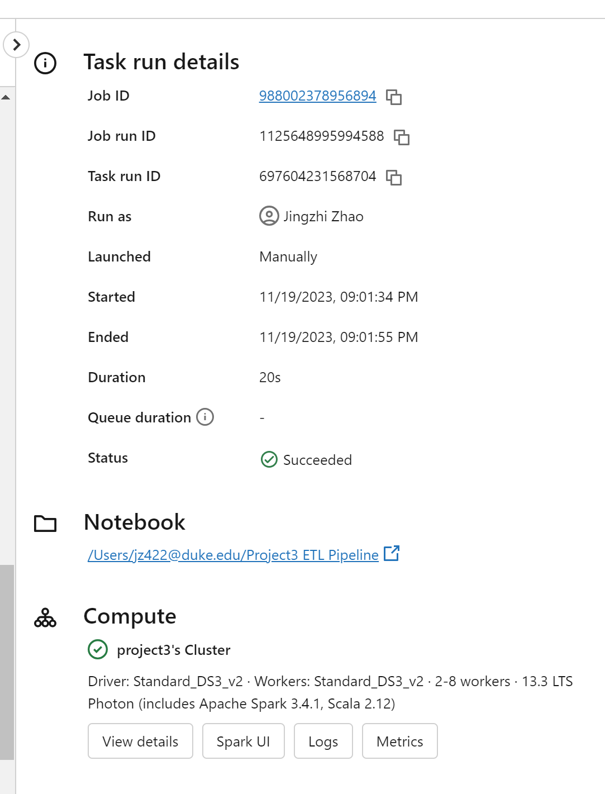

# Project3: Databricks ETL Pipeline

## Overview
This project follow [the basic ETL pipeline tutorial](https://docs.databricks.com/en/getting-started/etl-quick-start.html#) from Databricks.

This project demonstrates an ETL (Extract, Transform, Load) pipeline using Databricks, Delta Lake, and Spark SQL. It showcases how to efficiently extract data from a given source, apply necessary transformations, and load the data into a structured format suitable for analysis and reporting.

Here is the link to the Databricks notebook: [Project3 ETL Pipeline](https://adb-636253859913156.16.azuredatabricks.net/?o=636253859913156#notebook/3939950992228784)

## Video Demonstration
[Here](https://youtu.be/Xpyrg53JXGQ?si=mVKgXC5WVqQ4UjUk) is a comprehensive walkthrough of the ETL pipeline, demonstrating its features and functionalities.

## Features
- **Efficient Data Extraction:** Utilizing Databricks Auto Loader for scalable and real-time data ingestion from various sources.
- **Delta Lake for Data Storage:** Implements Delta Lake for reliable and robust data storage, taking advantage of its ACID transaction properties.
- **Spark SQL for Transformations:** Uses Spark SQL for performing advanced data transformations.
- **Data Visualization:** Includes visualizations for transformed data to provide insights and aid in decision-making.
- **Automated Pipeline Execution:** Incorporating automation to trigger the ETL process, facilitating regular data updates.
- **Error Handling and Data Validation:** Features robust error handling and validation checks to ensure data integrity.

## Requirements
- Databricks Runtime 7.x or higher
- Apache Spark 3.x
- Python 3.x
- Additional Python libraries: matplotlib, seaborn, pandas (for visualization)
- Access to /databricks-datasets/structured-streaming/events for JSON data

## Installation and Setup
1. Set up a Databricks Workspace: Create and configure a workspace in Databricks.
2. Cluster Configuration: Start a Databricks cluster with the required runtime and libraries.
3. Import Notebook: Import the ETL notebook into your Databricks workspace.

## Data Source
This project uses a structured streaming dataset, available in Databricks, simulating real-time event data. The dataset is in JSON format, encompassing diverse event types and attributes.

`/databricks-datasets/structured-streaming/events`

## Pipeline Explanation
### Extract
The data is extracted from a structured streaming dataset available in Databricks, containing real-time event information. Using Databricks’ Auto Loader, the pipeline automatically ingests JSON formatted data, ensuring efficient and scalable data processing.

### Transform
The pipeline utilizes Spark SQL for complex data transformations, including filtering, aggregation, and joining with other datasets to enrich the data. The pipeline includes checks for data quality and integrity, ensuring that the data is accurate and reliable for analysis.

### Load
The transformed data is loaded into Delta Lake, leveraging its ACID transaction properties and time-travel features for reliable data storage and easy version control.

## Visualizations and Insights

### Visualization Types
- **Bar Chart for Categorical Data:** The pipeline includes a bar chart that visualizes the distribution of different event actions in the dataset, providing insights into the most common activities.

- **Time Series Analysis:** A time series plot is used to show the frequency of events over time, highlighting any trends or patterns in the data, such as peak activity hours.

### Insights Gained
- **From Bar Chart:** The bar chart helps in identifying the most frequently occurring events, which can be crucial for understanding user behavior or system performance.

- **From Time Series Plot:** The time series analysis reveals any cyclical patterns or anomalies in event occurrences, which are essential for predictive maintenance or resource allocation.

## Workflow

## Usage
1. Go to the notebook and  press **SHIFT+ENTER** to run each cell of the notebook in sequence to execute the ETL process. Ensure you have the necessary access to the datasets and Databricks runtime.

2. Click **Schedule** on the right side of the header bar and run the pipeline.

3. Sample result of the pipeline

## Project Structure
- **.devcontainer** includes a Dockerfile and devcontainer.json. The **Dockerfile** within this folder specifies how the container should be built, and other settings in this directory may control development environment configurations.
- **workflows** includes GitHub Actions, which contain configuration files for setting up automated build, test, and deployment pipelines for your project.
- **.gitignore** is used to specify which files or directories should be excluded from version control when using Git.
- **Makefile** is a configuration file used in Unix-based systems for automating tasks and building software. It contains instructions and dependencies for compiling code, running tests, and other development tasks.
- **README.md** is the instruction file for the readers.
- **requirements.txt** is to specify the dependencies (libraries and packages) required to run the project.
- **test_main.py** is a test file for main.py that can successfully run in IDEs.
- **main.py** is a Python file that contains the main function.
- **Project3 ETL Pipeline.ipynb** is a IPython Notebook exported from Databricks Notebook to provide a quick review for the script.
